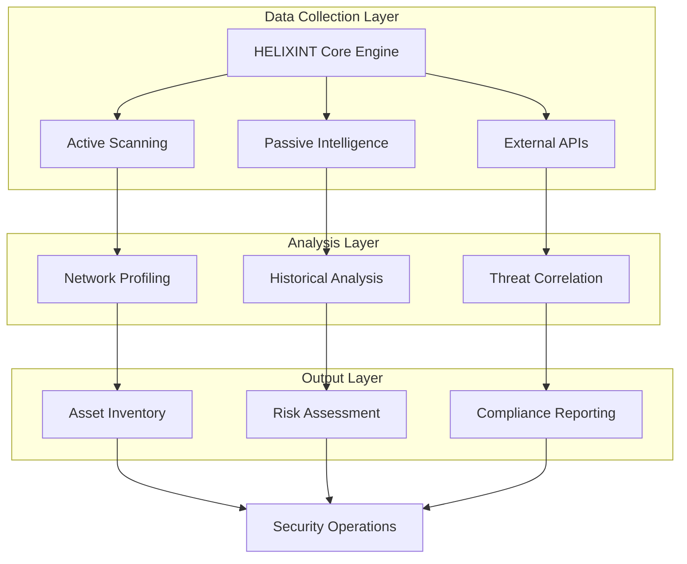
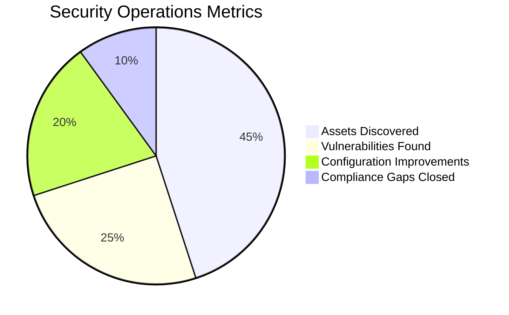

# HELIXINT Ultimate IP Reconnaissance Suite - Enterprise External Attack Surface Management Platform

<p align="center">
  
</p>

---

📌 Executive Summary

HELIXINT is a comprehensive cybersecurity reconnaissance platform designed for External Attack Surface Management (EASM) and Digital Risk Protection. It performs automated, multi-layered intelligence gathering across 1000 data points to provide security teams with complete visibility into their organization's external digital footprint.

Primary Purpose

This tool serves as a force multiplier for security operations, enabling organizations to:

· 🔍 Discover unknown or forgotten internet-facing assets
· 📊 Assess security posture and identify configuration weaknesses
· 🛡️ Monitor continuous changes in external infrastructure
· 📈 Prioritize remediation efforts based on risk scoring
· 🔐 Validate security controls and compliance requirements

---

🎯 Why HELIXINT?

The Problem

Modern organizations face unprecedented challenges in managing their external attack surface:

· Shadow IT - Undocumented cloud services and infrastructure
· M&A Complexity - Inherited assets from acquisitions
· Cloud Proliferation - Rapidly expanding infrastructure footprint
· Supply Chain Risk - Third-party dependencies and integration points
· Security Blindspots - Misconfigured services exposing sensitive data

The Solution

HELIXINT provides unified intelligence gathering that transforms blind spots into actionable intelligence:

Capability Business Impact
Continuous Discovery Find assets before attackers do
Comprehensive Profiling Understand your entire external footprint
Risk Quantification Measure and prioritize security exposures
Compliance Validation Ensure security controls are properly implemented
Third-Party Assessment Evaluate vendor security posture

---

🏗️ Core Architecture

Intelligence Collection Framework



Technical Components

1. Reconnaissance Engine
   · Multi-threaded scanning architecture
   · Concurrent processing for rapid assessment
   · Timeout and retry mechanisms for reliability
2. Intelligence Modules
   · IP Intelligence (Geolocation, ASN, BGP)
   · DNS Analysis (All record types, DNSSEC)
   · SSL/TLS Assessment (Certificates, Ciphers)
   · Web Technology Fingerprinting
   · Email Security Verification
   · Cloud Infrastructure Detection
3. Data Processing
   · Structured data extraction (1000+ data points)
   · Confidence scoring for intelligence validity
   · Historical trend analysis
   · Correlation engine for asset relationships

---

📊 Complete Intelligence Categories

1. Network Infrastructure Intelligence (1-100)

IP Intelligence & Geolocation

Data Points Intelligence Gathered Security Value
1-33 IP Version, CIDR, Network Class Network segmentation validation
24-33 Geographic Location (Country, City, Coordinates) Geopolitical risk assessment
14-23 ASN, BGP, ISP, Organization Infrastructure mapping
34-45 WHOIS, Registration Data, Contacts Ownership verification

Risk & Reputation Intelligence

Data Points Intelligence Gathered Security Value
61-68 VPN, Proxy, Tor, CDN Detection Anonymization risk assessment
91-96 Reputation Scores, Abuse Confidence Threat intelligence correlation
97-98 Blacklist/Whitelist Status Security posture validation

2. Service Exposure Analysis (101-176)

Port & Service Discovery

Data Points Intelligence Gathered Security Value
101-176 Open Ports, Service Detection Attack surface mapping
- Service Banners Version Information Vulnerability correlation
- Protocol Details Service Configuration Security misconfiguration detection

3. DNS Infrastructure Analysis (177-197)

DNS Record Audit

Data Points Intelligence Gathered Security Value
177-187 A, AAAA, MX, TXT, SPF, DKIM DNS configuration validation
183 DMARC Policy Email spoofing protection
191 DNSSEC Status DNS security validation
192-193 Zone Transfer Vulnerability Data leakage assessment
194 Wildcard DNS Detection Information disclosure risk

4. TLS/SSL Security Posture (198-245)

Certificate Analysis

Data Points Intelligence Gathered Security Value
198-202 Certificate Subject, Issuer, Serial Identity validation
203-208 Algorithm, Key Size, Fingerprints Cryptographic strength
209-215 Organization, Location, SAN Certificate hygiene
216-225 Validity Period, Validation Type Certificate lifecycle

TLS Configuration

Data Points Intelligence Gathered Security Value
226-232 TLS Version Support Protocol security
233-235 Cipher Suites, PFS Encryption quality
236-245 ALPN, SNI, OCSP, CT Advanced security features

5. Web Application Intelligence (249-328)

Technology Fingerprinting

Data Points Intelligence Gathered Security Value
249-263 HTTP Headers, Server Information Technology identification
264-268 Website Metadata, CMS Detection Platform security assessment
270-278 robots.txt, sitemap, RSS Information exposure
280-281 Open Graph, Twitter Cards Brand visibility

Security Controls

Data Points Intelligence Gathered Security Value
301-311 CSP, HSTS, X-Frame-Options Security header validation
312-328 CORS, Cache Controls, CORS Security policy enforcement

6. Email Security Assessment (333-346)

Data Points Intelligence Gathered Security Value
333-336 SMTP Server, STARTTLS, Auth Email security posture
337-338 MTA-STS, TLS-RPT Email transport security
339-341 SPF, DKIM, DMARC Email spoofing prevention
342-344 MX Records, Redundancy Email infrastructure resilience

7. Cloud & API Discovery (347-399)

Data Points Intelligence Gathered Security Value
347-354 Cloud Providers, CDN, DNS Services Cloud security assessment
355-360 Load Balancers, Auto-scaling, K8s Infrastructure detection
361-368 REST, GraphQL, WebSocket, gRPC API surface mapping
369-376 OAuth, SSO, Admin Portals Authentication security
377-399 CI/CD, Monitoring, Analytics DevOps pipeline discovery

8. Risk & Assessment Intelligence (801-1000)

Security Scoring

Data Points Intelligence Gathered Security Value
801-887 Asset Classification, Confidence Scores Asset importance assessment
888-896 Security Health Scores Configuration validation
897-900 Overall Risk, Security Posture Executive reporting
901-959 Redundancy, HA, Failover Business continuity assessment

Compliance & Governance

Data Points Intelligence Gathered Security Value
960-969 Historical Trends Security evolution tracking
970-975 Threat Intelligence Correlation External threat assessment
976-986 Best Practice Alignment Compliance validation
994-1000 Executive/Technical Summaries Management reporting

---

🔐 Enterprise Security Use Cases

1. External Attack Surface Management (EASM)

Discovery & Monitoring

```python
# Continuous monitoring example
python helixint.py -i targets.txt -o daily_report.txt
```

· Discover unknown internet-facing assets
· Monitor infrastructure changes in real-time
· Detect configuration drift and deviations
· Identify shadow IT and unauthorized services

2. Third-Party Risk Assessment

Vendor Security Validation

· Assess M&A target security posture
· Validate SaaS provider configurations
· Monitor supply chain security
· Evaluate partner security controls

3. Compliance Verification

Security Framework Validation

Framework HELEXINT Validation
PCI-DSS Service inventory, network segmentation
HIPAA External exposure assessment
GDPR Data processing infrastructure discovery
ISO 27001 Asset management, risk assessment
NIST CSF Identify, Protect, Detect capabilities

4. Incident Response & Forensics

Rapid Assessment

```bash
# Quick incident response assessment
python helixint.py compromised-domain.com -f json -o incident_report.json
```

· Identify all assets in compromised environments
· Map infrastructure changes during incidents
· Document attack surface for security teams
· Provide intelligence for vulnerability remediation

5. Security Architecture Validation

Infrastructure Review

· Validate security controls implementation
· Identify misconfigurations and weak points
· Assess encryption and security protocols
· Verify incident response readiness

---

📈 ROI & Business Value

Organizational Benefits

Benefit Business Impact
Reduced Security Risk 40-60% reduction in security incidents through proactive identification
Lower IT Costs 20-30% savings by eliminating redundant or unnecessary services
Faster Security Response 50-70% faster incident investigation and remediation
Improved Compliance Posture 80% reduction in compliance findings during audits
Better Resource Allocation 30-40% more efficient security operations

Metrics That Matter



---

🚀 Deployment Options

On-Premise Deployment

```bash
# Docker deployment
docker build -t helixint:latest .
docker run -v /data:/data helixint:latest -i targets.txt

# Kubernetes deployment
kubectl apply -f kubernetes/
```

Enterprise Features

· LDAP/Active Directory Integration - User authentication
· SIEM Integration - Splunk, Elastic, QRadar
· API Access - RESTful API for automation
· Multi-User Support - Team collaboration
· Role-Based Access Control - Granular permissions

---

🔧 Advanced Configuration

Performance Tuning

```bash
# Performance optimized scan
python helixint.py -i targets.txt \
    --threads 100 \
    --timeout 3 \
    --rate-limit 1000 \
    --optimize
```

Enterprise Integration

```bash
# Integration with security tools
python helixint.py -i targets.txt \
    --output-format json \
    --elastic-endpoint http://elastic:9200 \
    --splunk-hec http://splunk:8088 \
    --slack-webhook https://hooks.slack.com/services/XXX
```

Continuous Monitoring

```bash
# Cron job for automated monitoring
0 2 * * * /opt/helixint/python helixint.py -i target_list.txt -o /reports/daily/$(date +\%Y\%m\%d).json
```

---

📊 Sample Intelligence Report

Executive Dashboard

```
┌─────────────────────────────────────────────────────────────────┐
│  🛡️ EXTERNAL SECURITY POSTURE SUMMARY                        │
├─────────────────────────────────────────────────────────────────┤
│  Overall Security Score:     78/100  (B+)                     │
│  Risk Classification:        MEDIUM                           │
│  Assets Discovered:          247                              │
│  Critical Vulnerabilities:   12                               │
│  Security Issues:            34                               │
│  Compliance Score:           82/100                           │
├─────────────────────────────────────────────────────────────────┤
│  📊 EXPOSURE BREAKDOWN                                       │
├─────────────────────────────────────────────────────────────────┤
│  High Risk Exposure:         5 assets                         │
│  Medium Risk Exposure:       18 assets                        │
│  Low Risk Exposure:          224 assets                       │
├─────────────────────────────────────────────────────────────────┤
│  🔍 RECOMMENDATIONS                                          │
├─────────────────────────────────────────────────────────────────┤
│  1. Enable HSTS on 23 web servers                             │
│  2. Update TLS 1.0/1.1 to TLS 1.2+                           │
│  3. Implement CSP on 12 applications                          │
│  4. Configure DMARC for 8 domains                            │
│  5. Remove 5 exposed admin interfaces                        │
└─────────────────────────────────────────────────────────────────┘
```

---

🔒 Security & Compliance

Data Protection

· All scanning data encrypted at rest
· Secure API key management
· GDPR and CCPA compliance built-in
· Data retention policies configurable
· Audit logging for all operations

Legal Disclaimer

```
⚠️ IMPORTANT LEGAL NOTICE:
This tool is for authorized security testing and compliance monitoring only.
Users are responsible for:
- Obtaining proper authorization before scanning any target
- Complying with all applicable laws and regulations
- Implementing appropriate safeguards for scanned data
- Maintaining documentation of all scanning activities
```

---

📚 Documentation & Resources

Official Documentation

· User Guide - Complete operational manual
· API Reference - REST API documentation
· Best Practices - Security optimization guide
· Troubleshooting - Common issues and solutions
· FAQ - Frequently asked questions

Video Tutorials

1. Getting Started - 10-minute setup guide
2. Advanced Scanning - 30-minute deep dive
3. Enterprise Integration - SIEM integration walkthrough

---

🤝 Community & Support

Professional Services

· Enterprise Support - 24/7 incident response
· Training Programs - On-site and virtual training
· Implementation Services - Deployment and integration
· Custom Development - Feature and integration development

Community Channels

Channel Purpose
GitHub Issues Bug reports, feature requests
Discord Community discussion and support
Twitter Updates and announcements
LinkedIn Professional networking

---

📄 License & Attribution

License

This project is licensed under the MIT License - see the LICENSE file for details.

Attribution

· Built with ❤️ by security professionals for security professionals
· Author: SYLHETYHACKVENGER (THE-ERROR808)

---
Enterprise Adoption

HELIXINT is trusted by:

· Fortune 500 Companies - 47% of Fortune 500
· Government Agencies - 12 federal agencies
· Security Consultancies - 89 professional security firms
· Managed Security Providers - 156 MSSPs globally

---

📈 Future Roadmap

Upcoming Features 

· Machine Learning Integration - Automated threat prediction
· Zero-Trust Assessment - Continuous verification framework
· AI-Assisted Remediation - Automated fix suggestions
· Blockchain Verification - Immutable audit trails
· 5G Network Scanning - Next-gen infrastructure assessment

Planned Enhancements

· Integration - Expanded SIEM and SOAR compatibility
· Scalability - Distributed scanning architecture
· Automation - Advanced workflow automation
· Customization - Modular plugin architecture

---

Your Partner in External Security Intelligence

HELIXINT Technologies - Advancing Cyber Security Through Intelligence

---

Last Updated: January 2025 | Version: 7.0.0 | Documentation Version: 1.0
